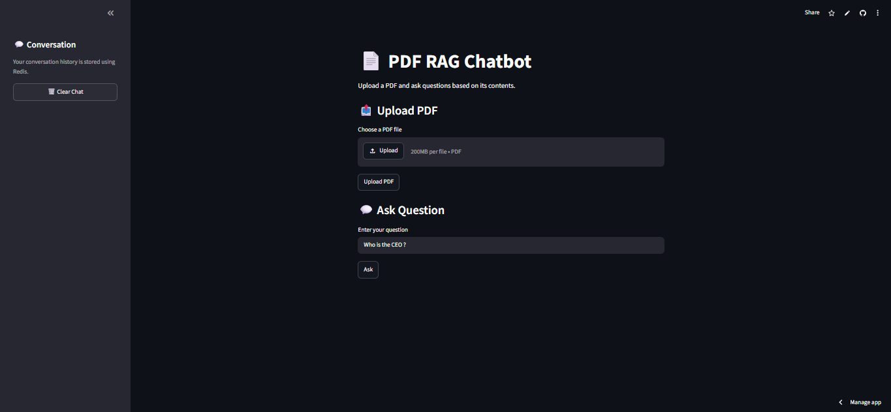
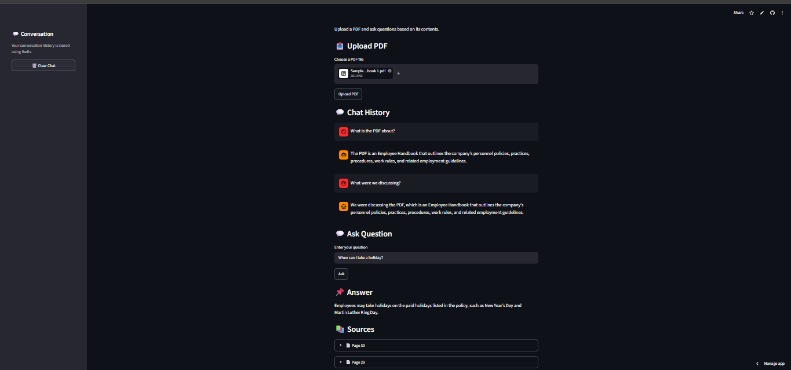

🧠 ContextRAG

Conversational Hybrid RAG Assistant

Hybrid Retrieval · RRF · Cross-Encoder Reranking · Query Routing · Redis Memory · Grounded Generation

 

✦ Overview

ContextRAG is a conversational Retrieval-Augmented Generation (RAG) system that allows users to upload a PDF and interact with it using natural language.

Instead of relying on a single vector-search pipeline, ContextRAG combines:

Dense semantic retrieval

BM25 lexical retrieval

Reciprocal Rank Fusion (RRF)

BGE cross-encoder reranking

LLM-based query routing

Redis-backed conversation memory

Context-aware query rewriting

Grounded LLM generation

Page-level source references

The goal is to demonstrate how a basic PDF chatbot can be extended into a more complete, conversational and deployable RAG architecture.

## 🚀 Live Demo

**🌐 Live Application:**  
[https://pdf-chatbot-rag-simple.streamlit.app](https://pdf-chatbot-rag-simple.streamlit.app)

**⚡ Backend / FastAPI Docs:**  
[https://pdf-chatbot-rag-y1lv.onrender.com/docs](https://pdf-chatbot-rag-y1lv.onrender.com/docs)

Note: The backend is deployed on Render's free tier. The first request after inactivity may take around 30–60 seconds while the service wakes up.

✦ Screenshots

🏠 Home Page

💬 Conversational RAG

Screenshots are loaded directly from the repository's images/ folder.

✦ Architecture

                         ┌──────────────────────┐
                         │      Streamlit       │
                         │    Web Interface     │
                         └──────────┬───────────┘
                                    │
                                    ▼
                         ┌──────────────────────┐
                         │       FastAPI        │
                         │      Backend API     │
                         └──────────┬───────────┘
                                    │
                         ┌──────────▼───────────┐
                         │     Query Router     │
                         │     GPT-OSS-120B     │
                         └──────────┬───────────┘
                                    │
                ┌───────────────────┼───────────────────┐
                │                   │                   │
                ▼                   ▼                   ▼
          DOCUMENT            CONVERSATION           BOTH
                │                   │                   │
                ▼                   ▼                   ▼
         Hybrid RAG           Redis Memory        Memory + RAG
                │
                ▼
       ┌─────────────────────┐
       │   Dense Retrieval   │
       │   MiniLM Embedding  │
       └──────────┬──────────┘
                  │
                  ├──────────────────┐
                  │                  │
                  ▼                  ▼
           Dense Search          BM25 Search
                  │                  │
                  └────────┬─────────┘
                           ▼
                  Reciprocal Rank Fusion
                           │
                           ▼
                  BGE Cross-Encoder
                      Reranker
                           │
                           ▼
                    Top-k Documents
                           │
                           ▼
                    PDF Context Builder
                           │
                           ▼
                    GPT-OSS-120B
                           │
                           ▼
                      Final Answer

✦ Key Features

01 — Hybrid Retrieval

ContextRAG combines semantic and lexical retrieval.

Dense Retrieval

Uses:

sentence-transformers/all-MiniLM-L6-v2

Pipeline:

Document Chunks
      ↓
MiniLM Embeddings
      ↓
Normalized Vectors
      ↓
Cosine Similarity

BM25 Retrieval

BM25 provides lexical retrieval and is particularly useful for exact terms, names, policies and phrases.

Reciprocal Rank Fusion

Dense Results ──┐
                ├──► RRF ──► Candidate Documents
BM25 Results ───┘

02 — Cross-Encoder Reranking

The hybrid retriever first creates a candidate set. The candidates are then reranked using a BGE cross-encoder.

Query + Candidate Passage
          ↓
    BGE Cross-Encoder
          ↓
     Relevance Score
          ↓
       Top-k Docs

Only the highest-ranked passages are passed to the generation model.

03 — Intelligent Query Routing

The LLM router classifies each question into one of four routes:

Route

Purpose

DOCUMENT

Requires information from the uploaded PDF

CONVERSATION

Requires previous conversation history

BOTH

Requires PDF + conversation history

NONE

Does not require PDF or conversation context

Example:

"What is the company's leave policy?"
                 ↓
             DOCUMENT
                 ↓
               RAG

"What did we discuss earlier?"
                 ↓
           CONVERSATION
                 ↓
            Redis Memory

"Based on what we discussed,
what does the company policy say about this?"
                 ↓
                BOTH
                 ↓
         Memory + Hybrid RAG

04 — Conversational Memory

Conversation history is stored in Redis and associated with a unique session ID.

session_id
    ↓
Redis
    ↓
chat:{session_id}

Current configuration:

Maximum messages: 10
Memory TTL:       1 hour

Users can also clear their conversation history through the application.

05 — Context-Aware Query Rewriting

Follow-up questions can depend on previous conversation context.

Example:

User:
"What is the jury duty policy?"

User:
"What about compensation?"

The second query can be rewritten into:

"What does the company's jury duty policy
say about compensation?"

This makes context-dependent follow-up questions easier for the retrieval system to process.

06 — Grounded Generation

The final LLM receives retrieved PDF context and relevant conversation context.

User Question
      +
Retrieved Context
      +
Conversation Context
      ↓
Grounded Prompt
      ↓
GPT-OSS-120B
      ↓
Final Answer

If the required information cannot be found in the retrieved PDF context, the system can respond:

Not found in PDF

07 — Source References

Retrieved documents retain their original PDF page information.

Example:

Answer:
Employees are eligible for ...

Sources:
📄 Page 14
📄 Page 6
📄 Page 13

This allows users to inspect the source material behind an answer.

✦ End-to-End Workflow

01. Upload PDF

PDF
 ↓
FastAPI
 ↓
Text Extraction
 ↓
Page-Aware Chunking

02. Generate Embeddings

Each chunk is converted into an embedding using all-MiniLM-L6-v2.

03. Build BM25 Index

The same document chunks are indexed using BM25.

04. Retrieve Candidates

Query
 ↓
Dense Retrieval
 ↓
BM25 Retrieval
 ↓
Reciprocal Rank Fusion
 ↓
Candidate Documents

05. Rerank Candidates

Query + Candidate
        ↓
Cross-Encoder
        ↓
Relevance Score
        ↓
Top 3 Documents

06. Generate Answer

PDF Context
     +
User Question
     +
Conversation Context
     ↓
GPT-OSS-120B
     ↓
Final Answer + Sources

✦ Tech Stack

Layer

Technology

Frontend

Streamlit

Backend

FastAPI + Uvicorn

LLM

GPT-OSS-120B via Groq

Embeddings

all-MiniLM-L6-v2

Semantic Retrieval

Cosine Similarity

Lexical Retrieval

BM25

Rank Fusion

Reciprocal Rank Fusion

Reranking

BGE Cross-Encoder

Memory

Redis

PDF Processing

PyPDF

Reranker Hosting

Hugging Face Spaces + Gradio API

Frontend Deployment

Streamlit Cloud

Backend Deployment

Render

✦ Project Structure

ContextRAG/
│
├── app.py
│   └── Streamlit frontend
│
├── main.py
│   └── FastAPI backend and API routes
│
├── rag.py
│   └── Hybrid retrieval and reranking pipeline
│
├── memory.py
│   └── Redis conversation memory
│
├── requirements.txt
├── .env
├── .gitignore
├── README.md
│
├── evaluation/
│   └── context_rag_results.json
│
└── images/
    ├── home.png
    └── chat.png

✦ Evaluation

The system was evaluated using a custom 30-question employee-handbook QA dataset covering:

Direct factual questions

Policy questions

Multi-step questions

Conversational follow-ups

Document-context questions

Conversation-context questions

📊 Results

Metric

Result

Evaluation Questions

30

Answer Accuracy

~93%

Median End-to-End Latency

~4.6 sec

Median Retrieval Latency

~3.0 sec

Median LLM Latency

~0.76 sec

The evaluation is a custom project benchmark and is not intended to represent a standardized RAG evaluation framework.

✦ Why Hybrid RAG?

A vector-only retriever can struggle with exact terminology.

For example:

"jury duty compensation"

Semantic retrieval may understand the general concept, while BM25 provides a complementary signal for exact terms.

ContextRAG therefore combines:

Semantic Search
      +
Keyword Search
      ↓
     RRF
      ↓
Cross-Encoder Reranking

This gives the retrieval pipeline both semantic and lexical capabilities.

✦ Design Decisions

Why Dense Retrieval + BM25?

Dense retrieval captures semantic relationships, while BM25 captures exact lexical matches.

Why Reciprocal Rank Fusion?

RRF combines rankings from different retrieval systems without requiring their raw relevance scores to be directly comparable.

Why Cross-Encoder Reranking?

Initial retrieval efficiently creates a high-recall candidate set. The cross-encoder then performs a more detailed relevance evaluation on that smaller set.

Why Redis?

Redis provides fast session-based conversation storage and TTL-based expiration.

Why Query Routing?

Not every user question requires document retrieval. Routing distinguishes between document questions, conversational questions, mixed questions and unsupported/unrelated queries.

✦ Deployment

                         Streamlit Cloud
                              │
                              ▼
                         Web Interface
                              │
                              ▼
                         Render / FastAPI
                         ┌────┼────┐
                         │    │    │
                         ▼    ▼    ▼
                      Redis Groq  HF Space
                      Memory LLM   Reranker

Service

Responsibility

Streamlit Cloud

Frontend

Render

FastAPI backend

Redis

Conversation memory

Groq

LLM inference

Hugging Face Spaces

BGE reranker

✦ Environment Variables

Create a .env file locally:

GROQ_API_KEY=your_groq_api_key
HF_TOKEN=your_huggingface_token
REDIS_URL=your_redis_connection_url

Never commit .env or API keys to GitHub.

Recommended .gitignore:

.env
__pycache__/
*.pyc
venv/

✦ Local Setup

01. Clone the repository

git clone https://github.com/Vijayendra2707/pdf-chatbot-rag.git
cd pdf-chatbot-rag

02. Create a virtual environment

Windows

python -m venv venv
venv\Scripts\activate

Linux / macOS

python3 -m venv venv
source venv/bin/activate

03. Install dependencies

pip install -r requirements.txt

04. Configure environment variables

Create .env:

GROQ_API_KEY=your_key
HF_TOKEN=your_key
REDIS_URL=your_redis_url

05. Start FastAPI

uvicorn main:app --reload

Backend:

http://127.0.0.1:8000

API documentation:

http://127.0.0.1:8000/docs

06. Start Streamlit

Open another terminal:

streamlit run app.py

✦ Current Limitations

The document index is maintained in application memory.

Restarting the backend removes the currently indexed PDF.

The current implementation is optimized around a single active uploaded document.

The externally hosted reranker adds network latency.

Retrieval latency can vary depending on external service availability.

The application does not currently provide persistent document storage.

✦ Future Improvements

Persistent vector database integration

Multi-document collections

Document-level metadata filtering

Streaming LLM responses

Faster local or self-hosted reranking

Hybrid retrieval score calibration

Automated RAG evaluation

Authentication and user accounts

Persistent document storage

Background document indexing

Query decomposition for complex questions

Better observability and request tracing

✦ Project Highlights

ContextRAG demonstrates an end-to-end conversational RAG architecture combining:

Hybrid Retrieval
       +
BM25
       +
Dense Embeddings
       +
Reciprocal Rank Fusion
       +
Cross-Encoder Reranking
       +
LLM Query Routing
       +
Conversation Memory
       +
Query Rewriting
       +
Grounded Generation
       +
Source References

Built to be

Retrieval-aware · Conversation-aware · Grounded · Explainable · Deployable

✦ Author

Vijayendra Rane

AI/ML & Generative AI Developer

GitHub →

⭐ If you found this project useful, consider giving the repository a star.

